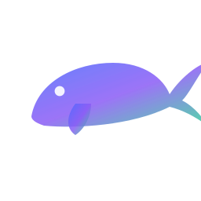
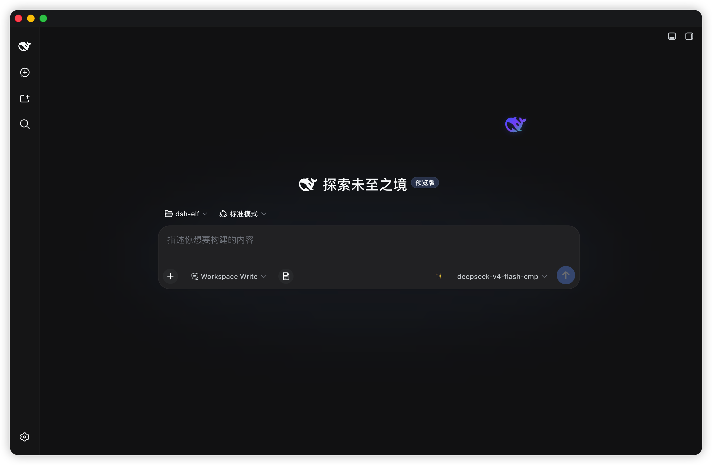
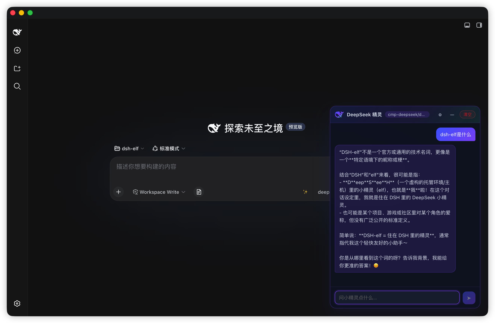

<p align="center">
  
</p>

# dsh-elf

English | [中文](README.zh.md)

[](LICENSE)
[](package.json)
[](https://www.npmjs.com/package/dsh-elf)

A DeepSeek whale elf that lives on your DSH page. A translucent, slowly drifting whale (rendered from the official DeepSeek favicon path, tinted blue → purple → green) hovers at the edge of the viewport; click it to open a lightweight, draggable chat window that never touches your session history.

## Screenshots

<p align="center">
  
  
</p>

## Features

- **Living elf** — the whale slowly wanders around its anchor point (sin/cos drift plus a bob animation); drag it anywhere and the position persists across restarts
- **Instant chat** — click to open, drag the title bar to move, `—` to minimize back to the elf
- **Zero-config by default** — follows the session's default model (the harness's configured provider), no API key required
- **Custom endpoint mode** — uncheck "follow session default" and plug in any OpenAI-compatible endpoint (DeepSeek / OpenAI / Moonshot / GLM / Qwen / custom base URL), streamed token-by-token directly from the browser
- **Real streaming** — host-route chats poll the streaming response (~55 ms) so text appears as it is generated; custom endpoints use native SSE
- **Nice-to-haves** — copy per message, one-click clear, model badge, light/dark theme, empty-state hint, drag clamping (you can't lose the elf off-screen)
- **Follows your language** — the elf UI switches between 中文 / English automatically, matching the language setting in DSH; no reload needed

## Requirements

- [DSH](https://github.com/deepseek-ai/deepseek-harness) with a `web` or `desktop` profile
- Node.js `^22.19.0` or `>=24.0.0` (only needed to build from source)
- [pnpm](https://pnpm.io) is recommended when installing into a profile

## Install

> The bundle entry (`id: elf`) is self-declared by this package's `cordis.patch.yml` —
> no manual patch file is needed.

### From npm

```sh
dsh plugin --profile desktop add dsh-elf
```

Restart DSH (quit fully and reopen), then a fresh page shows the elf at the bottom-right.

### From source (development)

```sh
git clone https://github.com/winditer/dsh-elf.git dsh-elf && cd dsh-elf
npm install
npm run build          # produces dist/client.js
dsh plugin --profile desktop add .    # links the workspace into the profile by package name
```

Or install by hand: in the target profile's `package.json` (e.g. `~/.dsh/profiles/desktop/package.json`):

```jsonc
{
  "dependencies": {
    "dsh-elf": "link:/absolute/path/to/dsh-elf"
    // ...
  },
  "dsh": {
    "profile": {
      "bundles": [ /* ... */, "dsh-elf" ]
    }
  }
}
```

then `pnpm install` inside the profile directory and restart DSH.

### Uninstall

Remove `dsh-elf` from the profile's `dependencies` and `dsh.profile.bundles`, then clean up the installed link (`rm -rf <profile>/node_modules/dsh-elf` or `pnpm --filter dsh-elf remove --dir <profile>`).

## Usage

- **Drag** the elf to park it anywhere (the drop position is persisted under `dsh-elf:orb`); **click** (without dragging) to open the chat window
- Chat header: model badge · `⚙` configuration · `—` minimize · `清空` clear
- `Enter` sends, `Shift+Enter` inserts a newline; hover a message and click `📋` to copy
- Chats are **temporary**: they are never written to DSH sessions and disappear when the plugin stops or you clear them

## Configuration

Open `⚙` in the chat header:

| Setting | Meaning |
| --- | --- |
| 跟随会话默认 (follow) | On: use the harness's session-default model automatically. Off: enable the fields below |
| 提供方 (provider) | Preset for the OpenAI-compatible base URL |
| API 地址 / API Key / 模型 | Base URL, key, and model name for the custom route |
| reasoning | Optional `reasoning_effort` (`high` / `medium` / `low`) for compatible models |

Settings are saved in the browser's `localStorage` (`dsh-elf:cfg`) together with chat history, positions and window mode (`dsh-elf:chat` / `dsh-elf:orb` / `dsh-elf:win` / `dsh-elf:mode`).

## Architecture

Two halves, one package:

- **Host half** — `lib/index.js` (= `src/host.js`). Registers a JSON API at `/dsh-elf/api` through the harness `webServer` service; runs the session-default chat via `llm.stream`; chats live in an in-memory `Map` that is cleared when the plugin unloads.
- **Client half** — `src/client.js`, bundled to `dist/client.js` (esbuild, wrapped in `__ModuleLoader__.load({ id: "dsh-elf", … })`; the id **must** equal the installed package name). Renders into the `shell.overlay` slot, talks to the host with `fetch` POSTs.

### Host API

All endpoints are `POST /dsh-elf/api/<method>`; every response is `{ ok: true, value }` or `{ ok: false, error }`.

| Method | Body | Returns |
| --- | --- | --- |
| `elf.sessionModel` | `{}` | `{ available, provider?, model?, reasoningEffort? }` — the session's default model |
| `elf.chat.start` | `{ messages: [{ role, text }] }` | `{ ok, chatId }` or `{ ok: false, error }` |
| `elf.chat.poll` | `{ chatId }` | `{ ok, done, text, error? }` — accumulated text while streaming; `done: true` at the end |
| `elf.chat.close` | `{ chatId }` | `{ ok }` |

Protocol details: only `POST` is accepted (405 otherwise); the body is JSON with a 1 MB cap (413); unknown methods return 404.

## Security notes

- **Default route sends no credentials** — it reuses the harness's configured provider.
- The **custom-mode API key stays in your browser** (`localStorage`), never on disk or over the wire to anything but the endpoint you configured.
- Chats are ephemeral and in-memory; nothing is written to DSH session history.

## Development

```sh
npm run build   # esbuild: src/client.js → dist/client.js (__ModuleLoader__ bundle)
npm run check   # node --check on both halves
npm test        # node --test (host mount regression + client bundle guards)
```

### Project layout

```
src/client.js      Client half (shell.overlay, plain browser timers, fetch → /dsh-elf/api)
src/host.js        Host half source (= lib/index.js, the Node entry)
lib/index.js       Package main — host half, loaded by the DSH host runtime
dist/client.js     Built client bundle (__ModuleLoader__ format, load id = dsh-elf)
cordis.patch.yml   Bundle entry declaration (insert: { id: elf, name: dsh-elf })
scripts/build.mjs  Build script (esbuild + bundle wrapper)
test/              node:test suites
assets/            Logo / whale artwork
```

### Gotchas (learned the hard way)

- **Bundle id must equal the package name** — `arrive()` throws `bundle loaded without registering <id>` otherwise. `scripts/build.mjs` hardcodes the correct id.
- **Profile bundles don't get the cordis `timer` service** — that service is installed only for dynamic cordis-runner packages. Use plain browser `setInterval`/`setTimeout` (disposed in React effect cleanup), exactly like the sibling `dshmarket` bundle.
- **Prefer `link:` over `file:`** when installing a workspace copy — `file:` copies files, so edits/rebuilds go stale.
- **Client changes go live on page refresh** (bundle `rev` is content-hashed); **host changes require a full DSH restart**.
- **Fresh publishes can trip the profile's `minimumReleaseAge` policy** — if the profile enforces pnpm's release-age supply-chain check, a version published less than ~24 h ago fails `dsh plugin … add <pkg>` with `ERR_PNPM_MINIMUM_RELEASE_AGE_VIOLATION`. Add the exact `name@version` to `minimumReleaseAgeExclude` in the profile's `pnpm-workspace.yaml` (and keep the entry current when you release a new version):

  ```yaml
  minimumReleaseAgeExclude:
    - dsh-elf@2.2.0
  ```

## License

[MIT](LICENSE)